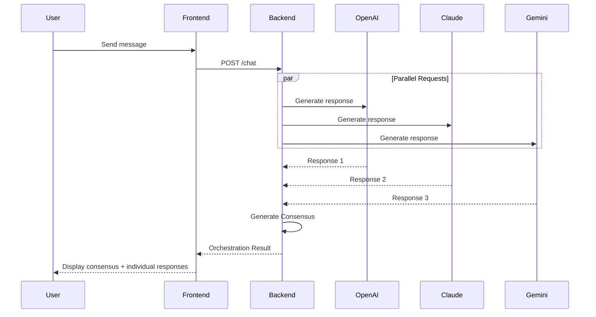

# AI Orchestration Service

A multi-AI orchestration platform that aggregates responses from multiple AI providers (OpenAI, Google Gemini, Anthropic Claude, Perplexity) and synthesizes a consensus response.

## 🌟 Features

- **Multi-Provider Support**: Query multiple AI models simultaneously
- **Consensus Generation**: AI-powered synthesis of multiple responses
- **Per-Provider Configuration**: Custom model and system prompt for each provider
- **Real-time Response Comparison**: View individual AI responses alongside the consensus
- **SwiftUI-inspired UI**: Modern, glassmorphism design with smooth animations
- **Role-based Prompts**: Pre-defined and custom roles for different use cases

## 🏗️ Architecture

```
┌─────────────────────────────────────────────────────────────────┐
│                        Frontend (Next.js)                        │
│  ┌──────────┐  ┌──────────┐  ┌──────────┐  ┌──────────────────┐ │
│  │  Chat UI │  │ Provider │  │  Role    │  │ Response Details │ │
│  │          │  │  Config  │  │ Selector │  │                  │ │
│  └──────────┘  └──────────┘  └──────────┘  └──────────────────┘ │
└─────────────────────────────┬───────────────────────────────────┘
                              │ HTTP API
┌─────────────────────────────┴───────────────────────────────────┐
│                        Backend (NestJS)                          │
│  ┌────────────────────────────────────────────────────────────┐ │
│  │                   Orchestration Service                     │ │
│  │  • Parallel requests to all providers                       │ │
│  │  • Consensus generation using AI                            │ │
│  │  • Error handling and fallback                              │ │
│  └────────────────────────────────────────────────────────────┘ │
│  ┌────────────────────────────────────────────────────────────┐ │
│  │                      AI Service                             │ │
│  │  ┌─────────┐ ┌─────────┐ ┌─────────┐ ┌─────────────────┐   │ │
│  │  │ OpenAI  │ │ Gemini  │ │ Claude  │ │   Perplexity    │   │ │
│  │  │ GPT-4o  │ │ 1.5 Pro │ │Sonnet 4 │ │ Sonar Large     │   │ │
│  │  └─────────┘ └─────────┘ └─────────┘ └─────────────────┘   │ │
│  └────────────────────────────────────────────────────────────┘ │
└─────────────────────────────────────────────────────────────────┘
```

## 📁 Project Structure

```
orchestration/
├── apps/
│   ├── backend/                 # NestJS Backend
│   │   └── src/
│   │       ├── ai/              # AI Provider Module
│   │       │   ├── providers/   # Individual AI providers
│   │       │   └── ai.service.ts
│   │       └── orchestration/   # Orchestration Module
│   │           ├── orchestration.controller.ts
│   │           └── orchestration.service.ts
│   │
│   └── frontend/                # Next.js Frontend
│       └── app/
│           ├── components/      # React Components
│           ├── hooks/           # Custom Hooks
│           ├── lib/             # API Client
│           └── settings/        # Settings Page
│
├── packages/
│   ├── shared/                  # Shared Types & Strings
│   ├── ui/                      # UI Components
│   └── eslint-config/           # ESLint Configuration
│
├── docker-compose.yml
├── turbo.json
└── pnpm-workspace.yaml
```

## 🚀 Getting Started

### Prerequisites

- Node.js >= 18
- pnpm >= 9.0

### Installation

```bash
# Clone the repository
git clone <repository-url>
cd orchestration

# Install dependencies
pnpm install
```

### Environment Setup

Create a `.env` file in `apps/backend/`:

```env
# Server Configuration
PORT=3001
FRONTEND_URL=http://localhost:3000

# OpenAI
OPENAI_API_KEY=your_openai_api_key
OPENAI_MODEL=gpt-4o

# Google Gemini
GEMINI_API_KEY=your_gemini_api_key
GEMINI_MODEL=gemini-1.5-pro

# Anthropic Claude
ANTHROPIC_API_KEY=your_anthropic_api_key
CLAUDE_MODEL=claude-sonnet-4-20250514

# Perplexity
PERPLEXITY_API_KEY=your_perplexity_api_key
PERPLEXITY_MODEL=llama-3.1-sonar-large-128k-online
```

### Running the Application

```bash
# Development mode (both frontend and backend)
pnpm dev

# Build for production
pnpm build

# Run with Docker
pnpm docker:dev
```

### Access the Application

- **Frontend**: http://localhost:3000
- **Backend API**: http://localhost:3001/api

## 📡 API Reference

### Get Available Providers

```http
GET /api/orchestration/providers
```

**Response:**

```json
{
  "providers": [
    {
      "name": "openai",
      "available": true,
      "displayName": "OpenAI",
      "defaultModel": "gpt-4o",
      "models": [{ "id": "gpt-4o", "name": "GPT-4o", "description": "Most capable" }]
    }
  ]
}
```

### Send Chat Message

```http
POST /api/orchestration/chat
Content-Type: application/json

{
  "prompt": "What is the future of AI?",
  "providerSettings": [
    {
      "provider": "openai",
      "model": "gpt-4o",
      "systemPrompt": "You are an analyst...",
      "enabled": true
    },
    {
      "provider": "claude",
      "model": "claude-sonnet-4-20250514",
      "enabled": true
    }
  ],
  "globalSystemRole": "You are a helpful assistant.",
  "conversationHistory": []
}
```

**Response:**

```json
{
  "query": "What is the future of AI?",
  "responses": [
    {
      "provider": "openai",
      "content": "AI will continue to evolve...",
      "model": "gpt-4o",
      "latencyMs": 1234
    }
  ],
  "consensus": {
    "summary": "Based on multiple AI perspectives...",
    "agreementLevel": "high",
    "keyPoints": ["Point 1", "Point 2"],
    "differences": ["Difference 1"]
  },
  "timestamp": "2024-01-01T00:00:00.000Z"
}
```

### Health Check

```http
GET /api/orchestration/health
```

## 🔧 How Consensus Works

1. **Parallel Requests**: User's prompt is sent to all enabled AI providers simultaneously
2. **Response Collection**: All successful responses are collected
3. **AI Synthesis**: One of the available AI providers analyzes all responses and generates:
   - A unified **summary** combining best insights
   - An **agreement level** (high/medium/low)
   - **Key points** of agreement
   - Notable **differences** between responses
4. **Fallback**: If synthesis fails, responses are combined as-is



## 🎨 UI Components

The project includes a custom UI component library (`packages/ui`) with SwiftUI-inspired components:

| Component  | Description                            |
| ---------- | -------------------------------------- |
| `Button`   | Primary and secondary variants         |
| `Input`    | Text input with label                  |
| `Textarea` | Multi-line text input with auto-resize |
| `Card`     | Container with glassmorphism effect    |
| `Toggle`   | iOS-style toggle switch                |
| `Select`   | Dropdown selector                      |
| `Badge`    | Status indicators                      |
| `Chip`     | Selectable tags                        |
| `Spinner`  | Loading indicator                      |

## 🛠️ Development

### Available Scripts

```bash
# Development
pnpm dev          # Start all apps in dev mode
pnpm build        # Build all packages and apps
pnpm lint         # Run ESLint
pnpm format       # Format code with Prettier

# Docker
pnpm docker:dev   # Start with Docker Compose
pnpm docker:build # Build Docker images
pnpm docker:down  # Stop Docker containers
```

### Adding a New AI Provider

1. Create a new provider in `apps/backend/src/ai/providers/`:

```typescript
@Injectable()
export class NewProvider implements AiProvider {
  readonly name: AiProviderName = 'newprovider';

  isAvailable(): boolean {
    /* ... */
  }
  getDefaultModel(): string {
    /* ... */
  }
  async complete(request: AiCompletionRequest): Promise<AiCompletionResponse> {
    /* ... */
  }
}
```

2. Register in `apps/backend/src/ai/ai.module.ts`
3. Add to `AiService` constructor and providers map
4. Update `AiProviderName` type in `packages/shared/src/types.ts`

## 📝 License

MIT

## 🤝 Contributing

Contributions are welcome! Please read the contributing guidelines before submitting a pull request.
